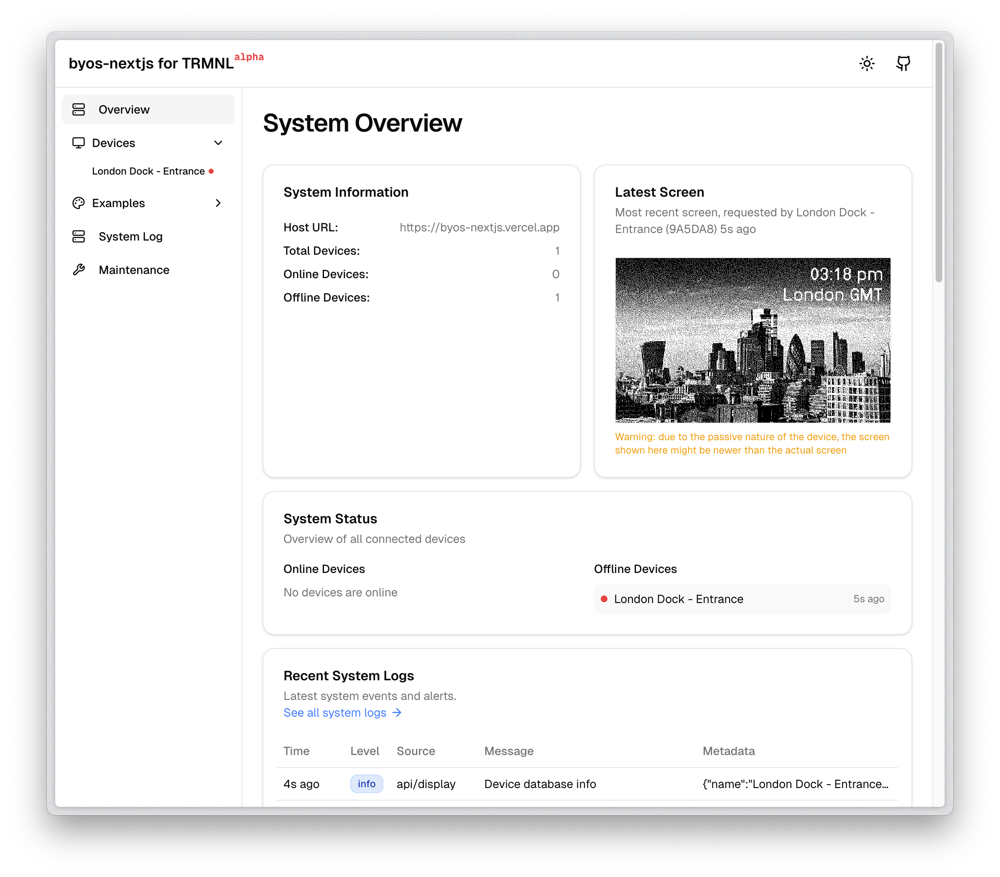

# BYOS Next.js for TRMNL 🖥️

[](https://github.com/usetrmnl/byos_next/blob/main/LICENSE)
[](https://nextjs.org/)
[](https://react.dev/)
[](https://tailwindcss.com/)
[](https://www.typescriptlang.org/)
[](https://supabase.com/)
[](https://github.com/usetrmnl/byos_next/pulls)
[](https://github.com/usetrmnl/byos_next/stargazers)
[](https://github.com/usetrmnl/byos_next/network/members)

[](https://vercel.com/new/clone?repository-url=https%3A%2F%2Fgithub.com%2Fghcpuman902%2Fbyos-nextjs&demo-title=BYOS%20Next.js&demo-description=Bring-Your-Own-Server%20built%20with%20Next.js%20for%20the%20TRMNL%20iot%20device&demo-url=https%3A%2F%2Fbyos-nextjs.vercel.app%2F&demo-image=https%3A%2F%2Fbyos-nextjs.vercel.app%2Fbyos-nextjs-screenshot.png&project-name=byos-nextjs&stores=%5B%7B%22type%22%3A%22integration%22%2C%22integrationSlug%22%3A%22supabase%22%2C%22productSlug%22%3A%22supabase%22%7D%5D)

## 📖 Table of Contents
- [Overview](#-overview)
- [Features](#-features)
- [Quick Start](#-quick-start)
- [How It Works](#-how-it-works)
- [Installation](#-installation)
- [Usage](#-usage)
- [Troubleshooting](#-troubleshooting)
- [Contributing](#-contributing)
- [Community](#-community)

## 🚀 Overview

**BYOS (Build Your Own Server) Next.js** is a community-maintained library for the TRMNL device, designed to provide a flexible and customizable server solution. This Next.js implementation offers a robust, modern approach to device management and display generation.

## ✨ Features


live demo: [https://byos-nextjs.vercel.app/](https://byos-nextjs.vercel.app/)

- 🔧 Customizable device management
- 🖼️ Dynamic screen generation
- 🚀 Easy deployment to Vercel
- 📊 Comprehensive logging system
- 🔒 Secure API key management
- 💻 Modern tech stack (Next.js 15, React 19, Tailwind CSS v4)
- 🧹 Clean, standardized codebase with Biome for formatting
- ⚠️ Using a canary version of Shadcn for Tailwind v4 support; be cautious with AI-generated code.

## 🗺️ Roadmap

This project is in the **Alpha** stage. Here's our development roadmap:

### Current Progress
- ✅ Core functionality for device management
- ✅ Dynamic screen generation
- ✅ Supabase integration
- ✅ Examples framework
- ✅ Codebase refactoring and standardization
- ✅ Improved initialization flow (2025-03-11)
- ✅ "No database" mode for simpler deployments (2025-03-11)

### Coming Soon
- 🔄 More pixelated fonts
- 🔄 More template examples
- 🔄 MySQL/local file support
- 🔄 Demo mode for testing without affecting production devices

### Future Plans
- 📝 Enhanced documentation
- 🧪 Testing framework
- 🔒 Advanced authentication options

### Reporting Issues
If you encounter any problems:

1. **GitHub Issues**: Open an issue on our [GitHub repository](https://github.com/usetrmnl/byos_next/issues)
2. **Email**: Send details to [manglekuo@gmail.com](mailto:manglekuo@gmail.com)
3. **Discussions**: Reply to my message in the TRMNL Discord server

## 🏁 Quick Start

### Option 1: Deploy to Vercel

[](https://vercel.com/new/clone?repository-url=https%3A%2F%2Fgithub.com%2Fghcpuman902%2Fbyos-nextjs&demo-title=BYOS%20Next.js&demo-description=Bring-Your-Own-Server%20built%20with%20Next.js%20for%20the%20TRMNL%20iot%20device&demo-url=https%3A%2F%2Fbyos-nextjs.vercel.app%2F&demo-image=https%3A%2F%2Fbyos-nextjs.vercel.app%2Fbyos-nextjs-screenshot.png&project-name=byos-nextjs&stores=%5B%7B%22type%22%3A%22integration%22%2C%22integrationSlug%22%3A%22supabase%22%2C%22productSlug%22%3A%22supabase%22%7D%5D)

1. Click the Vercel deployment button
2. Link a free Supabase database
3. Follow the deployment instructions
4. Open the deployed app and initialize the database tables
5. Point your device to the deployed app (see [How It Works](#-how-it-works) for details)

> **Note for local development**: once setup, sync enviroment variables to your local development by:
> 1. go to [https://supabase.com/dashboard/project/_/settings/integrations](https://supabase.com/dashboard/project/_/settings/integrations)
> 2. if not linked already, link your supabase project to vercel
> 3. under Vercel Integration, find "manage", turn on "preview" and "development", and then "Resync environment variables"
>4. now using `vercel link` and `vercel env pull`, you should see these environment variables in your local `.env.local` file:
```
NEXT_PUBLIC_SUPABASE_ANON_KEY
NEXT_PUBLIC_SUPABASE_URL
POSTGRES_DATABASE
POSTGRES_HOST
POSTGRES_PASSWORD
POSTGRES_PRISMA_URL
POSTGRES_URL
POSTGRES_URL_NON_POOLING
POSTGRES_USER
SUPABASE_ANON_KEY
SUPABASE_JWT_SECRET
SUPABASE_SERVICE_ROLE_KEY
SUPABASE_URL
```

### Option 2: Local Development Setup

#### Prerequisites
- Node.js (v20 or later)
- pnpm, npm, or yarn
- Git

#### Installation Steps
```bash
# Clone the repository
git clone https://github.com/usetrmnl/byos_next
cd byos-nextjs

# Install dependencies
pnpm install # or npm install or yarn install
```
Set up a Supabase account and add these environment variables to your `.env.local` file:
```
NEXT_PUBLIC_SUPABASE_URL
NEXT_PUBLIC_SUPABASE_ANON_KEY
```
Manually initialize the database tables in your Supabase SQL editor:
```sql
-- Enable UUID generation extension
CREATE EXTENSION IF NOT EXISTS "uuid-ossp";

-- Devices Table
CREATE TABLE public.devices (
    id BIGSERIAL PRIMARY KEY,
    friendly_id VARCHAR NOT NULL UNIQUE,
    name VARCHAR NOT NULL,
    mac_address VARCHAR NOT NULL UNIQUE,
    api_key VARCHAR NOT NULL UNIQUE,
    screen VARCHAR NULL DEFAULT NULL,
    refresh_schedule JSONB NULL,
    timezone TEXT NOT NULL DEFAULT 'UTC',
    last_update_time TIMESTAMPTZ NULL,
    next_expected_update TIMESTAMPTZ NULL,
    last_refresh_duration INTEGER NULL,
    battery_voltage NUMERIC NULL,
    firmware_version TEXT NULL,
    rssi INTEGER NULL,
    created_at TIMESTAMPTZ DEFAULT CURRENT_TIMESTAMP,
    updated_at TIMESTAMPTZ DEFAULT CURRENT_TIMESTAMP
);

-- Indexes for Devices
CREATE INDEX idx_devices_refresh_schedule ON public.devices USING GIN (refresh_schedule);

-- Logs Table
CREATE TABLE public.logs (
    id BIGSERIAL PRIMARY KEY,
    device_id BIGINT NOT NULL,
    friendly_id TEXT NULL,
    log_data TEXT NOT NULL,
    created_at TIMESTAMPTZ DEFAULT CURRENT_TIMESTAMP,
    CONSTRAINT logs_friendly_id_fkey FOREIGN KEY (friendly_id) REFERENCES public.devices (friendly_id)
);

-- System Logs Table
CREATE TABLE public.system_logs (
    id UUID DEFAULT uuid_generate_v4() PRIMARY KEY,
    created_at TIMESTAMPTZ DEFAULT now(),
    level VARCHAR NOT NULL,
    message TEXT NOT NULL,
    source VARCHAR NULL,
    metadata TEXT NULL,
    trace TEXT NULL
);

-- Indexes for System Logs
CREATE INDEX idx_system_logs_created_at ON public.system_logs (created_at);
CREATE INDEX idx_system_logs_level ON public.system_logs (level);
```

Start the development server:
```bash
# Start development server
pnpm run dev # or npm run dev or yarn run dev
```

### Code Formatting
This project uses Biome for code formatting. To format your code:

```bash
# Format code
pnpm lint
```

### Important Note
When dealing with AI-generated code, be aware that Tailwind v4 has some syntax differences. Use the following command to add new Shadcn components:
```bash
pnpm dlx shadcn@canary add [component1] [component2] [component3]
```

## 🔍 How It Works

### 1. Device Interaction Endpoints

The BYOS architecture provides three main endpoints for device interaction:

#### Setup Endpoint (`/api/setup`)
- **Purpose**: Device registration and API key generation
- **Usage**: Called when a device is reset or lacks an API key
- **Request Flow**:
  - Device sends MAC address in request headers
  - Server checks if the device exists in the database
  - If new, generates a unique API key and friendly device ID
  - Returns API key to the device for future authentication

```bash
curl -X GET http://[YOUR BASE URL]/api/setup \
-H "Content-Type: application/json" \
-H "ID: 12:34:56:78:9A:BC"
```

**Response Example**:
```json
{
   "status": 200,
   "api_key": "uniqueApiKeyGenerated",
   "friendly_id": "DEVICE_ABC123",
   "message": "Device successfully registered"
}
```

#### Display Endpoint (`/api/display`)
- **Purpose**: Primary endpoint for screen content delivery
- **Usage**: Called repeatedly by the device after setup to get new screens
- **Key Functions**:
  1. Provides the URL for the next screen to display
  2. Specifies how long the device should sleep before requesting again
  3. Can optionally signal firmware reset/update requirements
  
```bash
curl -X GET http://[YOUR BASE URL]/api/display \
-H "Content-Type: application/json" \
-H "ID: 12:34:56:78:9A:BC" \
-H "Access-Token: uniqueApiKey"
```

**Response Example**:
```json
{
   "status": 0,
   "image_url": "https://your-base-url/api/bitmap/DEVICE_ID_TIMESTAMP.bmp",
   "filename": "DEVICE_ID_TIMESTAMP.bmp",
   "refresh_rate": 180,
   "reset_firmware": false,
   "update_firmware": false
}
```

> **Note**: This implementation does not currently handle button functionality.

#### Log Endpoint (`/api/log`)
- **Purpose**: Error and issue reporting
- **Usage**: Called when errors or issues occur on the device
- **Behavior**: Logs are stored in the Supabase database for troubleshooting

### 2. Screen Generation Approach

Unlike the official Ruby/Python implementations, this Next.js implementation:

- **Generates screens on-demand**: When a device requests a display update
- **Leverages Next.js caching**: Uses built-in caching mechanisms for performance
- **Dynamic BMP generation**: The bitmap URL is a dynamic API endpoint
- **Efficient revalidation**: 
  - First request may take longer to generate the screen
  - Subsequent requests are served from cache while revalidating in the background
  - This approach provides both speed and fresh content

#### Technical Specifications
- **Image Format**: 800x480 pixel 1-bit bitmap (.bmp)
- **Rendering**: Uses Satori for dynamic image generation
Rendering pipeline:
JSX component -> pre-satori wrapper -> satori (svg) -> vercel image response (png) -> jimp (bmp) -> fixed header to fit TRMNL display

- **Caching Strategy**: 60-second revalidation window

### 3. Authentication Considerations

**Important**: This implementation does not include a comprehensive authentication system.

- **No user management**: Unlike some official implementations, there is no built-in user field in the database
- **Basic device authentication**: Only verifies device MAC address and API key
- **Production deployment recommendations**:
  - Implement your own authentication layer (e.g., NextAuth, SupabaseAuth)
  - Use middleware for request validation
  - Update the database schema to include user management if needed
  - Consider rate limiting and other security measures

## 🧪 Examples

The project includes an examples section to visualize and test components in both direct rendering and bitmap (BMP) rendering forms. This helps develop and test components for the TRMNL device.

### How Examples Work

Visit `[base url]/examples` to view the examples page.

To set up your own screen example, use the following structure:

1. Create your component folder in the `app/examples/screens` directory following any existing examples.
2. Add your component and data fetching logic
3. Add an entry to `app/examples/screens.json`

Each screen is defined in `app/examples/screens.json` and can be accessed via its slug.

This allows you to code and preview before pointing your device to any of the screens.

## 🤝 Contributing

We welcome contributions! Please see our [Contributing Guidelines](CONTRIBUTING.md) for details on:
- Reporting bugs
- Suggesting features
- Submitting pull requests

### Ways to Contribute
- Report issues on GitHub
- Submit pull requests
- Improve documentation
- Share use cases and feedback

## 🌐 Community

- 📢 [GitHub Discussions](https://github.com/usetrmnl/byos_nextjs/discussions)
- 🐦 [Twitter @usetrmnl](https://twitter.com/usetrmnl)
- 💬 Join our community channels

## 📚 Learn More
- [Next.js Documentation](https://nextjs.org/docs)
- [Supabase Documentation](https://supabase.com/docs)
- [TRMNL Device Website](https://usetrmnl.com)

## 📄 License

This project is open-source and available under the MIT License.

---

**Happy Coding! 🚀**


